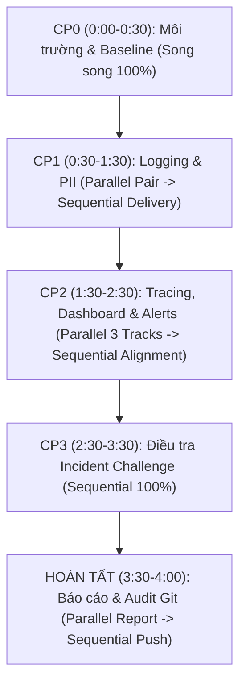
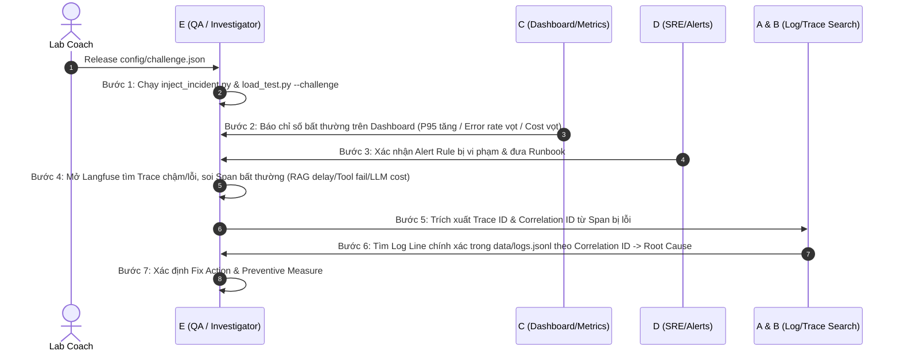
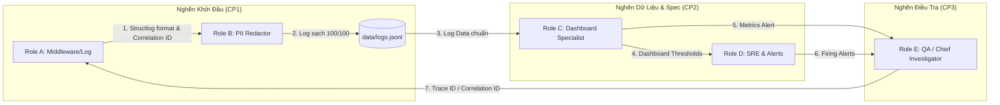

# Kế Hoạch Phân Công Nhiệm Vụ & Quy Trình Phối Hợp Nhóm 5 Thành Viên

## Dự án: Day 13 — Observability cho Hệ Thống AI

> **Mục tiêu**: Biến hệ thống AI API (`FastAPI`, `Langfuse`, `Structlog`) từ trạng thái thiếu quan sát thành hệ thống chuẩn sản xuất có khả năng đo đếm chỉ số (Metrics), khoanh vùng vết (Traces), truy vết log chi tiết theo Correlation ID (Logs), loại bỏ PII và điều tra sự cố (Incident Challenge) có bằng chứng minh bạch.

---

## 1. Bảng Phân Vai Tổng Quan & Trách Nhiệm Chính

| Thành Viên | Vai Trò (Role) | Phạm Vi Triển Khai Chính | Artifacts / Evidence Đảm Nhận |
| :--- | :--- | :--- | :--- |
| **Thành viên A** | **API & Middleware Engineer** | - CP1: `CorrelationIdMiddleware`, gán Correlation ID (`req-<8-char-hex>`).<br>- Bind contextvars vào logger (`user_id_hash`, `session_id`, `feature`, `model`, `env`).<br>- Bổ sung global Exception Handler và response headers (`x-request-id`, `x-response-time-ms`). | - [`app/middleware.py`](file:///e:/hung/VinAI/Lab/Lab13/K4-Day13-E402-HHQDA/app/middleware.py)<br>- [`app/main.py`](file:///e:/hung/VinAI/Lab/Lab13/K4-Day13-E402-HHQDA/app/main.py)<br>- Evidence Log có Correlation ID |
| **Thành viên B** | **Security & Data Protection Engineer** | - CP1: PII Scrubbing trong [`app/pii.py`](file:///e:/hung/VinAI/Lab/Lab13/K4-Day13-E402-HHQDA/app/pii.py) (Email, Phone VN, CCCD, Credit Card, Passport, Address...).<br>- Đăng ký `scrub_event` processor vào `structlog` trong [`app/logging_config.py`](file:///e:/hung/VinAI/Lab/Lab13/K4-Day13-E402-HHQDA/app/logging_config.py).<br>- Kiểm chứng log không lộ PII bằng [`scripts/validate_logs.py`](file:///e:/hung/VinAI/Lab/Lab13/K4-Day13-E402-HHQDA/scripts/validate_logs.py). | - `validate_logs.py` đạt 100/100<br>- Evidence PII Redacted (`submission/evidence/pii_redacted.png`) |
| **Thành viên C** | **Metrics & Dashboard Specialist** | - CP1/CP2: Đo đếm `error_rate_pct`, `request_failed`, `request_received` trong [`app/metrics.py`](file:///e:/hung/VinAI/Lab/Lab13/K4-Day13-E402-HHQDA/app/metrics.py).<br>- Thiết kế & dựng Dashboard 6 nhóm chỉ số từ [`config/dashboard.yaml`](file:///e:/hung/VinAI/Lab/Lab13/K4-Day13-E402-HHQDA/config/dashboard.yaml).<br>- Kiểm tra validator [`scripts/validate_dashboard.py`](file:///e:/hung/VinAI/Lab/Lab13/K4-Day13-E402-HHQDA/scripts/validate_dashboard.py). | - Dashboard contract hợp lệ 6/6 panel<br>- Evidence Dashboard Runtime (`submission/evidence/dashboard.png`) |
| **Thành viên D** | **SRE & Alerts Engineer** | - CP2: Cấu hình mục tiêu SLO trong [`config/slo.yaml`](file:///e:/hung/VinAI/Lab/Lab13/K4-Day13-E402-HHQDA/config/slo.yaml).<br>- Xây dựng Alert Rules trong [`config/alert_rules.yaml`](file:///e:/hung/VinAI/Lab/Lab13/K4-Day13-E402-HHQDA/config/alert_rules.yaml).<br>- Soạn thảo Alert Runbook chi tiết xử lý sự cố tại [`docs/alerts.md`](file:///e:/hung/VinAI/Lab/Lab13/K4-Day13-E402-HHQDA/docs/alerts.md). | - `config/slo.yaml`<br>- `config/alert_rules.yaml`<br>- `docs/alerts.md` |
| **Thành viên E** | **QA & Chief Investigator (Trưởng Nhóm)** | - CP0: Chạy load test baseline.<br>- CP2: Langfuse Trace & Prompt Versioning (`day13-chat` v1/v2, label/rollback), bọc trace sub-components (RAG/LLM).<br>- CP3: Dẫn dắt điều tra Challenge chính thức (`config/challenge.json`), tổng hợp [`submission/REPORT.md`](file:///e:/hung/VinAI/Lab/Lab13/K4-Day13-E402-HHQDA/submission/REPORT.md). | - Trace waterfall & Prompt rollback evidence<br>- Evidence Challenge investigation<br>- `submission/REPORT.md` hoàn thiện |

---

## 2. Chi Tiết Nhiệm Vụ Theo Checkpoint Thời Gian (0:00 – 4:00)



---

### Checkpoint 0 — 0:00 – 0:30: Setup & Baseline Môi Trường

> ⚡ **THỨ TỰ THỰC HIỆN**: **⚡ SONG SONG 100% (Fully Parallel)**
> - Tất cả 5 thành viên (A, B, C, D, E) độc lập cài đặt môi trường (`.venv`, `pip install`), cấu hình `.env` dùng chung Langfuse keys hoàn toàn **SONG SONG** với nhau mà không cần đợi ai.

- **Tất cả thành viên (Song song)**:
  - Clone repository, khởi tạo Virtual Environment (`python -m venv .venv`), kích hoạt môi trường và cài đặt `pip install -r requirements.txt`.
  - Cấu hình file `.env` từ `.env.example` với thông tin Langfuse chung do Trưởng nhóm E hoặc Lab Coach cung cấp.
- **Nhiệm vụ riêng từng role (Song song)**:
  - **⚡ Role A**: Khởi chạy API server: `uvicorn app.main:app --reload --env-file .env` và xác nhận endpoint `http://127.0.0.1:8000/health` trả về `{"ok": true}`.
  - **⚡ Role B**: Kiểm tra danh sách PII mẫu trong dữ liệu `data/sample_queries.jsonl`.
  - **⚡ Role C**: Mở `config/dashboard.yaml` để nắm vững contract 6 panel dashboard.
  - **⚡ Role D**: Mở `config/slo.yaml` để xem các mục tiêu latency, error rate, cost, quality.
  - **⚡ Role E**: Chạy script tạo log baseline: `python scripts/load_test.py`, sau đó chạy `python scripts/validate_logs.py` để ghi lại điểm số ban đầu vào báo cáo.

---

### Checkpoint 1 — 0:30 – 1:30: Logging, Contextvars & PII Redaction

*Mục tiêu CP1: Đảm bảo mọi log sinh ra có đầy đủ metadata, Correlation ID dạng `req-<8-char-hex>` và PII được che triệt để. Script `validate_logs.py` đạt 100/100.*

> ⚡ **THỨ TỰ THỰC HIỆN**: **🔄 KẾT HỢP (Hybrid: Parallel trong nhóm A & B $\rightarrow$ Sequential bàn giao cho C, D, E)**
>
> 1. **Giai đoạn 1 — SONG SONG (Pair Coding 30-45 phút đầu)**:
>    - ⚡ **Role A** (API & Middleware): Viết `CorrelationIdMiddleware` ([app/middleware.py](file:///e:/hung/VinAI/Lab/Lab13/K4-Day13-E402-HHQDA/app/middleware.py)) & gán contextvars (`user_id_hash`, `session_id`, `feature`, `model`, `env`) trong [app/main.py](file:///e:/hung/VinAI/Lab/Lab13/K4-Day13-E402-HHQDA/app/main.py).
>    - ⚡ **Role B** (Security): Bổ sung regex patterns trong [app/pii.py](file:///e:/hung/VinAI/Lab/Lab13/K4-Day13-E402-HHQDA/app/pii.py) & viết processor `scrub_event` trong [app/logging_config.py](file:///e:/hung/VinAI/Lab/Lab13/K4-Day13-E402-HHQDA/app/logging_config.py).
>    - ⚡ **Role C**: Cập nhật hàm accumulators & snapshot trong [app/metrics.py](file:///e:/hung/VinAI/Lab/Lab13/K4-Day13-E402-HHQDA/app/metrics.py) (song song với A & B).
>    - ⚡ **Role D & E**: Nghiên cứu trước cấu hình Traces, Prompt Versioning và Alert Rules (song song).
>
> 2. **Giai đoạn 2 — NỐI TIẾP BẮT BỘC (Sequential Execution Order)**:
>    - 🔗 **Bước 1**: Role A hoàn thành Middleware & Contextvars.
>    - 🔗 **Bước 2**: Role B lấy code của A, chèn `scrub_event` processor ngay trước `JsonlFileProcessor` trong `structlog.configure()`.
>    - 🔗 **Bước 3**: Role A & B phối hợp chạy `python scripts/load_test.py` sinh log thực tế.
>    - 🔗 **Bước 4**: Role B chạy `python scripts/validate_logs.py` kiểm tra đạt điểm 100/100 (0 PII leak, 100% correlation ID).
>    - 🔗 **Bước 5 (BÀN GIAO)**: Đạt 100/100 $\rightarrow$ Bàn giao file `data/logs.jsonl` chuẩn cho **Role C, D, E** tiếp tục CP2.

#### Chi tiết công việc từng Role:

#### Thành viên A (API & Middleware Engineer):
1. **Sửa file [`app/middleware.py`](file:///e:/hung/VinAI/Lab/Lab13/K4-Day13-E402-HHQDA/app/middleware.py)**:
   - Trong `CorrelationIdMiddleware.dispatch`:
     - Gọi `clear_contextvars()` ở đầu request để tránh rò rỉ context giữa các request bất đồng bộ.
     - Lấy `x-request-id` từ `request.headers`. Nếu chưa có, sinh UUID mới theo định dạng: `f"req-{uuid.uuid4().hex[:8]}"`.
     - Gọi `bind_contextvars(correlation_id=correlation_id)`.
     - Lưu `request.state.correlation_id = correlation_id`.
     - Thêm header vào response: `response.headers["x-request-id"] = correlation_id` và `response.headers["x-response-time-ms"] = str(round((time.perf_counter() - start) * 1000, 2))`.
2. **Sửa file [`app/main.py`](file:///e:/hung/VinAI/Lab/Lab13/K4-Day13-E402-HHQDA/app/main.py)**:
   - Trong route `/chat`: trước khi log `request_received`, thực hiện băm `user_id` bằng `hash_user_id(body.user_id)` và bind contextvars:
     ```python
     bind_contextvars(
         user_id_hash=hash_user_id(body.user_id),
         session_id=body.session_id,
         feature=body.feature,
         model=agent.model,
         env=os.getenv("APP_ENV", "dev")
     )
     ```
   - Thêm Exception Handler tổng quan để khi code ném ngoại lệ, log `request_failed` vẫn được ghi kèm `error_type` và `correlation_id`.

#### Thành viên B (Security & Data Protection Engineer):
1. **Sửa file [`app/pii.py`](file:///e:/hung/VinAI/Lab/Lab13/K4-Day13-E402-HHQDA/app/pii.py)**:
   - Bổ sung đầy đủ regex patterns bảo mật trong `PII_PATTERNS`:
     - `email`: `r"[\w\.-]+@[\w\.-]+\.\w+"`
     - `phone_vn`: `r"(?<!\d)(?:\+84|0)(?:[ .-]?\d){9}(?!\d)"`
     - `cccd`: `r"\b\d{12}\b"`
     - `credit_card`: `r"\b\d{4}[- ]?\d{4}[- ]?\d{4}[- ]?\d{4}\b"`
     - `passport`: `r"\b[A-Z]\d{7,8}\b"` (bổ sung mở rộng)
     - `address_vn`: `r"(?i)\b(số|đường|phường|quận|tp|thành phố|tỉnh)\b.*"` (bổ sung mở rộng)
2. **Sửa file [`app/logging_config.py`](file:///e:/hung/VinAI/Lab/Lab13/K4-Day13-E402-HHQDA/app/logging_config.py)**:
   - Cập nhật hàm `scrub_event`: quét và che PII ở tất cả các trường string trong `event_dict` (bao gồm `event`, `payload`, các giá trị lồng nhau).
   - Đăng ký `scrub_event` processor vào `structlog.configure(processors=[...])` **NGAY TRƯỚC** `JsonlFileProcessor()` và `JSONRenderer()`.
3. **Kiểm thử Security**:
   - Chạy `python scripts/load_test.py`, sau đó chạy `python scripts/validate_logs.py`.
   - Đảm bảo kết quả báo:
     - `+ [PASSED] Basic JSON schema`
     - `+ [PASSED] Correlation ID propagation`
     - `+ [PASSED] Log enrichment`
     - `+ [PASSED] PII scrubbing`
     - `Estimated Score: 100/100`.
   - Lưu file log mẫu chứa log đã che PII để phục vụ evidence.

#### Thành viên C (Metrics & Dashboard Specialist):
1. **Sửa file [`app/metrics.py`](file:///e:/hung/VinAI/Lab/Lab13/K4-Day13-E402-HHQDA/app/metrics.py)**:
   - Đảm bảo hàm `record_error(error_type)` tích lũy đúng số lượng lỗi theo `error_breakdown`.
   - Cập nhật phép tính `percentile(values, p)` và `snapshot()` chuẩn xác để trả về thông tin qua API `/metrics`.

---

### Checkpoint 2 — 1:30 – 2:30: Metrics, Traces, Dashboard & SLO/Alerts

*Mục tiêu CP2: Hoàn thiện Prompt Versioning & Tracing trên Langfuse, dựng Dashboard 6 panel hợp lệ contract, thiết lập SLO & Alert Rules.*

> ⚡ **THỨ TỰ THỰC HIỆN**: **⚡ SONG SONG 3 NHÁNH $\rightarrow$ 🔗 NỐI TIẾP KHÓA THRESHOLD & DỮ LIỆU**
>
> 1. **Giai đoạn 1 — SONG SONG 3 NHÁNH ĐỘC LẬP**:
>    - ⚡ **Nhánh Tracing (Role E)**: Tạo prompt `day13-chat` v1 (`baseline`, `production`) & v2 (`candidate`) trên Langfuse Cloud, chạy test rollback và gắn decorator `@observe` trong [app/agent.py](file:///e:/hung/VinAI/Lab/Lab13/K4-Day13-E402-HHQDA/app/agent.py).
>    - ⚡ **Nhánh Dashboard (Role C)**: Đọc `data/logs.jsonl` đã sạch từ CP1 để dựng 6 panel Dashboard runtime, kiểm tra hợp lệ contract bằng `python scripts/validate_dashboard.py`.
>    - ⚡ **Nhánh SLO & Alerts (Role D)**: Cấu hình mục tiêu trong [config/slo.yaml](file:///e:/hung/VinAI/Lab/Lab13/K4-Day13-E402-HHQDA/config/slo.yaml), soạn Alert Rules trong [config/alert_rules.yaml](file:///e:/hung/VinAI/Lab/Lab13/K4-Day13-E402-HHQDA/config/alert_rules.yaml) và viết Alert Runbook trong [docs/alerts.md](file:///e:/hung/VinAI/Lab/Lab13/K4-Day13-E402-HHQDA/docs/alerts.md).
>
> 2. **Giai đoạn 2 — NỐI TIẾP BẮT BỘC (Sequential Alignment)**:
>    - 🔗 **Bước 1**: Role C chạy `validate_dashboard.py` báo `HỢP LỆ: 6/6 panel`.
>    - 🔗 **Bước 2**: Role D lấy đúng các giá trị đơn vị & threshold chính thức từ Dashboard của C (P95 <= 3000ms, Error rate <= 2%) để cập nhật khóa điều kiện cảnh báo trong `alert_rules.yaml` & `docs/alerts.md`.
>    - 🔗 **Bước 3**: Role E chạy kịch bản thử nghiệm sự cố practice (`rag_slow`) để C kiểm tra Dashboard có phản ánh latency nhảy vọt không, D kiểm tra alert có trigger không, và E kiểm tra Trace waterfall có soi ra span chậm không.

#### Chi tiết công việc từng Role:

#### Thành viên E (QA & Chief Investigator - Phụ trách Trace & Prompt):
1. **Langfuse Prompt Versioning** (Theo [`docs/PROMPT_VERSIONING.md`](file:///e:/hung/VinAI/Lab/Lab13/K4-Day13-E402-HHQDA/docs/PROMPT_VERSIONING.md)):
   - Tạo prompt `day13-chat` trên Langfuse console với 3 biến: `Feature={{feature}}`, `Docs={{docs}}`, `Question={{message}}`.
   - Tạo **Version 1**: Gắn label `baseline` và `production`.
   - Tạo **Version 2**: Thay đổi nhỏ cấu trúc câu trả lời, gắn label `candidate`.
   - Chạy `load_test.py` với `LANGFUSE_PROMPT_LABEL=baseline` và `candidate` để sinh traces.
   - Thao tác gán lại label `production` cho Version 2, sau đó thực hiện **Rollback** về Version 1.
   - Chụp ảnh minh chứng: Danh sách 2 prompt versions, Trace hiển thị `prompt_name`, `prompt_label`, `prompt_version`, và thao tác Rollback.
2. **Sub-component Tracing** (Phần mở rộng):
   - Đảm bảo trong [`app/agent.py`](file:///e:/hung/VinAI/Lab/Lab13/K4-Day13-E402-HHQDA/app/agent.py), decorator `@observe` được áp dụng cho `run`, và gọi `langfuse_client.update_current_trace(...)`, `update_current_generation(...)` đầy đủ.
   - Bổ sung `@observe(as_type="span")` cho hàm `retrieve` trong [`app/mock_rag.py`](file:///e:/hung/VinAI/Lab/Lab13/K4-Day13-E402-HHQDA/app/mock_rag.py) và `generate` trong [`app/mock_llm.py`](file:///e:/hung/VinAI/Lab/Lab13/K4-Day13-E402-HHQDA/app/mock_llm.py) để có Waterfall trace chi tiết.

#### Thành viên C (Metrics & Dashboard Specialist):
1. **Xây dựng Dashboard**:
   - Dựa trên contract [`config/dashboard.yaml`](file:///e:/hung/VinAI/Lab/Lab13/K4-Day13-E402-HHQDA/config/dashboard.yaml) và dữ liệu chuẩn `data/logs.jsonl`.
   - Thiết lập đúng 6 panel:
     1. **Latency**: P50, P95, P99 (`response_sent.latency_ms`), Threshold: P95 <= 3000ms.
     2. **Traffic**: Request count / rate per minute (`request_received`), Threshold: >= 1 req/min.
     3. **Errors**: Error rate % & breakdown (`request_failed` / `request_received`), Threshold: Error rate <= 2%.
     4. **Cost**: Sum cost over time & total USD (`response_sent.cost_usd`), Threshold: Total <= 2.5$.
     5. **Tokens**: Sum `tokens_in`, `tokens_out` (`response_sent`), Threshold: <= 50,000 tokens.
     6. **Quality**: Mean `quality_score` (`response_sent`), Threshold: Mean >= 0.75.
2. **Kiểm tra Validator**:
   - Chạy lệnh: `python scripts/validate_dashboard.py`.
   - Kết quả bắt buộc: `HỢP LỆ: 6/6 panel có trong dashboard contract.`
3. **Chụp Runtime Evidence**:
   - Chụp ảnh giao diện Dashboard runtime hiển thị đủ 6 panel, có tên panel, time range (60m), đơn vị và đường ngưỡng Threshold/SLO.

#### Thành viên D (SRE & Alerts Engineer):
1. **Thiết lập SLO** trong [`config/slo.yaml`](file:///e:/hung/VinAI/Lab/Lab13/K4-Day13-E402-HHQDA/config/slo.yaml):
   - Cấu hình các chỉ số mục tiêu: Latency P95 (3000ms - 99.5%), Error Rate (2% - 99.0%), Cost (2.5$ - 100%), Quality Score (0.75 - 95.0%).
2. **Viết Alert Rules** trong [`config/alert_rules.yaml`](file:///e:/hung/VinAI/Lab/Lab13/K4-Day13-E402-HHQDA/config/alert_rules.yaml):
   - Định nghĩa tối thiểu 3 alerts symptom-based:
     - Alert 1: `HighLatencyP95` (P95 latency > 3000ms trong 5 phút).
     - Alert 2: `HighErrorRate` (Error rate > 2% trong 3 phút).
     - Alert 3: `CostSpike` (Chi phí trung bình mỗi request tăng gấp 3 lần baseline).
3. **Soạn thảo Alert Runbook** trong [`docs/alerts.md`](file:///e:/hung/VinAI/Lab/Lab13/K4-Day13-E402-HHQDA/docs/alerts.md):
   - Điền chi tiết cho cả 3 alerts: Severity, SLI/SLO liên quan, Điều kiện duy trì, Ảnh hưởng người dùng, 3 bước kiểm tra đầu tiên, Mitigation tạm thời và Owner.

---

### Checkpoint 3 — 2:30 – 3:30: Điều Tra Challenge Chính Thức

*Mục tiêu CP3: Khi Lab Coach release `config/challenge.json`, cả nhóm phối hợp điều tra sự cố theo đúng luồng 3 lớp: Metrics $\rightarrow$ Traces $\rightarrow$ Logs.*

> ⚡ **THỨ TỰ THỰC HIỆN**: **🔗 NỐI TIẾP NGHIÊM NGẶT 100% (Strictly Sequential Step-by-Step)**
>
> 🛑 *Ở CP3, cả nhóm PHẢI làm việc nối tiếp theo đúng luồng điều tra 3 lớp (Metrics $\rightarrow$ Traces $\rightarrow$ Logs), không được nhảy bước:*



#### Quy trình thực hiện nối tiếp từng bước tại CP3:

1. 🔗 **Bước 1 (Trigger - Role E & Coach)**:
   - Khi có `config/challenge.json`, **Role E** kích hoạt challenge:
     ```bash
     python scripts/inject_incident.py
     python scripts/load_test.py --challenge --concurrency 5
     ```
2. 🔗 **Bước 2 — Metrics Layer (Role C)**:
   - **Role C** quan sát Dashboard để khoanh vùng triệu chứng bất thường (ví dụ Latency P95 nhảy từ 200ms lên 2700ms, hoặc Error rate nhảy lên 100%, hoặc Token/Cost tăng vọt) $\rightarrow$ Báo tin cho E & D.
3. 🔗 **Bước 3 — Alerts Layer (Role D)**:
   - **Role D** đối chiếu với Alert Rules & SLO để xem alert nào đang firing $\rightarrow$ Cung cấp hướng dẫn xử lý từ Runbook.
4. 🔗 **Bước 4 — Traces Layer (Role E)**:
   - **Role E** truy cập Langfuse Console, mở danh sách Traces trong khung thời gian diễn ra incident.
   - Khoanh vùng Trace ID bất thường và mở Waterfall view để soi thời gian của từng Span (`retrieve` vs `generate`).
   - Ví dụ: Thấy span `retrieve` chiếm 2500ms -> Suy ra nghẽn ở thành phần Vector Store / Retrieval.
5. 🔗 **Bước 5 — Logs Layer & Root Cause (Role A, B, E)**:
   - **Role E** trích xuất `correlation_id` từ metadata của Trace đó gửi cho A & B.
   - **Role A & B** dùng lệnh `grep` tra cứu trong `data/logs.jsonl`:
     ```bash
     grep "req-xxxx" data/logs.jsonl
     ```
   - Trích xuất Log line chi tiết (ví dụ log `request_failed` hoặc log `service: retrieval` có error stacktrace).
6. 🔗 **Bước 6 — Fix Action & Defense (Cả nhóm)**:
   - **Role E & A** ghi nhận Root Cause, đề xuất Fix Action (sửa code/timeout) và Preventive Measure (bổ sung alert/circuit breaker).

---

### Hoàn Tất — 3:30 – 4:00: Báo Cáo, Rà Soát & Demo Nhóm

> ⚡ **THỨ TỰ THỰC HIỆN**: **🔄 KẾT HỢP (Song Song Soạn Báo Cáo $\rightarrow$ Nối Tiếp Audit & Push Code)**
>
> 1. **Giai đoạn 1 — SONG SONG (Tổng hợp tài liệu)**:
>    - ⚡ **Role E**: Tổng hợp và điền nội dung chính vào [submission/REPORT.md](file:///e:/hung/VinAI/Lab/Lab13/K4-Day13-E402-HHQDA/submission/REPORT.md).
>    - ⚡ **Role B**: Audit an toàn Git (kiểm tra `.gitignore`, đảm bảo không lộ `.env`, secret key hay raw PII).
>    - ⚡ **Role A, C, D**: Chuẩn bị nội dung giải trình cá nhân cho phần Demo nhóm.
>
> 2. **Giai đoạn 2 — NỐI TIẾP BẮT BỘC (Khóa dữ liệu & Push Git)**:
>    - 🔗 **Bước 1**: Mỗi cá nhân tự điền bảng Đóng góp cá nhân & link commit/PR của mình vào Mục 7 file `REPORT.md`.
>    - 🔗 **Bước 2**: Chạy lại 3 lệnh tự động cuối cùng: `pytest -q`, `validate_logs.py`, `validate_dashboard.py`.
>    - 🔗 **Bước 3**: Role E kiểm tra toàn bộ file `REPORT.md` không còn mục trống $\rightarrow$ Thực hiện `git commit` và `git push origin main`.

#### Chi tiết công việc từng Role:

#### Thành viên E (Trưởng nhóm):
- Điền toàn bộ kết quả vào [`submission/REPORT.md`](file:///e:/hung/VinAI/Lab/Lab13/K4-Day13-E402-HHQDA/submission/REPORT.md):
  - Mục 1: Thông tin nhóm, Repo URL, Commit SHA cuối, Bảng phân công 5 người.
  - Mục 2: Kết quả `validate_logs.py` (100/100), tổng số traces (>=10), rò rỉ PII (0).
  - Mục 3: Đường dẫn ảnh Evidence Correlation ID, PII Redaction, Trace Waterfall.
  - Mục 4: Thông tin Prompt Versioning (Name, Baseline version ID, Candidate version ID, Rollback evidence).
  - Mục 5: Kết quả `validate_dashboard.py`, ảnh Dashboard, SLO & Alert rules.
  - Mục 6: Báo cáo điều tra Challenge (Metrics $\rightarrow$ Trace ID $\rightarrow$ Log line/Correlation ID $\rightarrow$ Root cause $\rightarrow$ Fix $\rightarrow$ Preventive).
  - Mục 7: Đóng góp cá nhân từng người kèm link commit/PR.

#### Thành viên B (Security Audit):
- Rà soát toàn bộ dự án trước khi commit:
  - Đảm bảo file `.env`, API Keys (`pk-lf-...`, `sk-lf-...`), thư mục `.venv/` **KHÔNG** bị commit vào Git.
  - Kiểm tra `git status` và `.gitignore`.

#### Thành viên A, C, D:
- Chạy lại bộ kiểm tra tự động cuối cùng:
  ```bash
  python -m pytest -q
  python scripts/validate_logs.py
  python scripts/validate_dashboard.py
  ```
- Push toàn bộ code và evidence lên Git repository.
- Chuẩn bị sẵn kịch bản Demo 3 phút theo đúng luồng: **Metrics $\rightarrow$ Traces $\rightarrow$ Logs $\rightarrow$ Root Cause**.

---

## 3. Phân Tích Điểm Nghẽn (Bottlenecks) & Ma Trận Phụ Thuộc giữa Các Role

Trong quy trình làm việc 4 giờ, có **4 điểm nghẽn chí mạng (Critical Bottlenecks)** nếu một vai trò làm chậm tiến độ:



### Chi Tiết 4 Điểm Nghẽn & Biện Pháp Khắc Phục:

#### 🚨 Điểm Nghẽn 1: Role A & B $\rightarrow$ Toàn Nhóm (Nghẽn Hạ Tầng Logging & PII)
- **Mô tả điểm nghẽn**: Role C (Dashboard), D (Alerts) và E (QA/Tracing) đều cần dữ liệu log chuẩn từ `data/logs.jsonl`. Nếu **Role A** chưa bind `correlation_id` hoặc **Role B** chưa đăng ký `scrub_event` processor, toàn bộ log sinh ra sẽ bị hỏng schema hoặc rò rỉ PII.
- **Biểu hiện**: Lệnh `validate_logs.py` bị trượt, `data/logs.jsonl` thiếu trường `correlation_id` hoặc chứa email/phone thô.
- **Ai phải đợi ai?**: **Role C, D, E PHẢI ĐỜI Role A & B** hoàn thành CP1 (trong 45-60 phút đầu).
- **Giải pháp xử lý**:
  - Role A và B làm việc cặp (Pair Programming) trong 30 phút đầu của CP1.
  - Sau khi A & B hoàn thành, chạy `python scripts/load_test.py` để sinh ra file log chuẩn đầu tiên.

#### 🚨 Điểm Nghẽn 2: Role A & B $\rightarrow$ Role C (Nghẽn Event Schema Dashboard)
- **Mô tả điểm nghẽn**: Role C dựng Dashboard 6 panel cần các trường log cụ thể: `response_sent.latency_ms`, `cost_usd`, `quality_score`, `tokens_in`, `tokens_out`, `request_failed.error_type`. Nếu Role A log sai tên trường (ví dụ log `latency` thay vì `latency_ms`), Dashboard của C sẽ đọc ra giá trị 0 hoặc null.
- **Ai phải đợi ai?**: **Role C PHẢI ĐỢI Role A** chốt cấu trúc log event trong `app/main.py`.
- **Giải pháp xử lý**: Role C đưa bảng contract `config/dashboard.yaml` cho Role A đối chiếu trước khi Role A viết dòng `log.info("response_sent", ...)` và `log.error("request_failed", ...)`.

#### 🚨 Điểm Nghẽn 3: Role C $\rightarrow$ Role D (Nghẽn Ngưỡng Cảnh Báo SLO/Alerts)
- **Mô tả điểm nghẽn**: Role D viết Alert Rules (`config/alert_rules.yaml`) cần dựa trên chỉ số và threshold của Dashboard (ví dụ P95 latency limit = 3000ms, Error rate limit = 2%). Nếu Role C chưa chốt unit hoặc phép tổng hợp, Role D không thể viết condition chính xác trong Alert Runbook.
- **Ai phải đợi ai?**: **Role D PHẢI ĐỢI Role C** xác nhận 6 nhóm chỉ số và threshold từ Dashboard contract.
- **Giải pháp xử lý**: Role D sử dụng trực tiếp các giá trị chuẩn được quy định sẵn trong `config/dashboard.yaml` để soạn thảo `config/alert_rules.yaml` và `docs/alerts.md` mà không cần đợi UI Dashboard dựng xong hoàn toàn.

#### 🚨 Điểm Nghẽn 4: System (A, B, C, D) & Lab Coach $\rightarrow$ Role E (Nghẽn Điều Tra Challenge CP3)
- **Mô tả điểm nghẽn**: Role E là Chief Investigator, có nhiệm vụ kết nối 3 lớp: **Metrics (C) $\rightarrow$ Traces (E) $\rightarrow$ Logs (A/B)**.
  - Nếu C chưa có Dashboard $\rightarrow$ E không nhìn thấy triệu chứng.
  - Nếu Langfuse chưa gắn `prompt_version` $\rightarrow$ E không biết phiên bản prompt gây lỗi.
  - Nếu Log của A/B thiếu `correlation_id` $\rightarrow$ E không thể từ Trace ID tra ra Log line cụ thể để chứng minh Root Cause.
  - Nếu Lab Coach chưa release `config/challenge.json` $\rightarrow$ E chưa có input challenge chính thức.
- **Ai phải đợi ai?**: **Role E PHẢI ĐỢI cả 4 Role A, B, C, D hoàn thiện CP1 & CP2**, đồng thời đợi **Lab Coach release challenge file**.
- **Giải pháp xử lý**:
  - Trong lúc chờ CP3, Role E chủ động luyện tập quy trình điều tra trước bằng scenario practice:
    ```bash
    python scripts/inject_incident.py --scenario rag_slow
    ```
  - Kiểm tra xem từ Trace bị chậm có tra ra đúng log line `rag_slow` không. Khi Coach release `config/challenge.json`, E chỉ cần thực hiện lại kịch bản đã thuần thục.

---

## 4. Danh Sách Artifacts & Evidence Bắt Buộc Phải Nộp

Toàn bộ file minh chứng phải được đặt trong thư mục [`submission/evidence/`](file:///e:/hung/VinAI/Lab/Lab13/K4-Day13-E402-HHQDA/submission/evidence/) và dẫn liên kết trong [`submission/REPORT.md`](file:///e:/hung/VinAI/Lab/Lab13/K4-Day13-E402-HHQDA/submission/REPORT.md):

| STT | Tên File Evidence | Mô Tả Nội Dung | Người Trách Nhiệm Chính |
| :---: | :--- | :--- | :---: |
| 1 | `validate_logs_result.txt` / `.png` | Kết quả chạy `validate_logs.py` đạt 100/100 | **Role B** |
| 2 | `log_correlation_id.png` | Ảnh log JSON thể hiện trường `correlation_id` dạng `req-xxxx` | **Role A** |
| 3 | `pii_redacted.png` | Log chứng minh email, sđt, thẻ... đã được đổi thành `[REDACTED_*]` | **Role B** |
| 4 | `traces_list.png` | Giao diện Langfuse hiển thị danh sách tối thiểu 10 traces | **Role E** |
| 5 | `trace_waterfall.png` | Chi tiết 1 trace waterfall có các spans (`retrieve`, `generate`) | **Role E** |
| 6 | `prompt_versions.png` | Danh sách 2 phiên bản prompt (`day13-chat` v1 & v2) trên Langfuse | **Role E** |
| 7 | `prompt_rollback.png` | Ảnh minh chứng thao tác đổi label `production` hoặc Rollback prompt | **Role E** |
| 8 | `validate_dashboard_result.txt` / `.png` | Kết quả chạy `validate_dashboard.py` báo hợp lệ 6/6 panel | **Role C** |
| 9 | `dashboard_runtime.png` | Dashboard runtime đủ 6 panel, có time range, unit và threshold line | **Role C** |
| 10 | `challenge_investigation.png` | Ảnh minh chứng điều tra Challenge: Metrics abnormal + Trace + Log | **Role E & C** |

---

## 5. Checklist Tự Kiểm Tra Trước Khi Nộp Bài (Final Checklist)

Trước khi submit URL repository và Commit SHA, cả nhóm cùng rà soát các lệnh sau:

- [ ] **Kiểm tra Public Tests**:
  ```bash
  python -m pytest -q
  ```
  *(Tất cả tests trong `tests/` phải PASS)*

- [ ] **Kiểm tra Logging & PII Contract**:
  ```bash
  python scripts/validate_logs.py
  ```
  *(Đạt 100/100, không còn rò rỉ PII)*

- [ ] **Kiểm tra Dashboard Contract**:
  ```bash
  python scripts/validate_dashboard.py
  ```
  *(Trả về `HỢP LỆ: 6/6 panel`)*

- [ ] **Kiểm tra An Toàn Git & Security**:
  ```bash
  git status --short
  ```
  *(Đảm bảo không có `.env`, API key, `.venv/` hoặc log chứa PII bị staging)*

- [ ] **Kiểm tra File Báo Cáo**:
  - File [`submission/REPORT.md`](file:///e:/hung/VinAI/Lab/Lab13/K4-Day13-E402-HHQDA/submission/REPORT.md) đã điền đầy đủ 7 mục, không còn để trống.
  - Bảng đóng góp cá nhân tại Mục 7 đã có đầy đủ link Commit/PR cho cả 5 thành viên.
